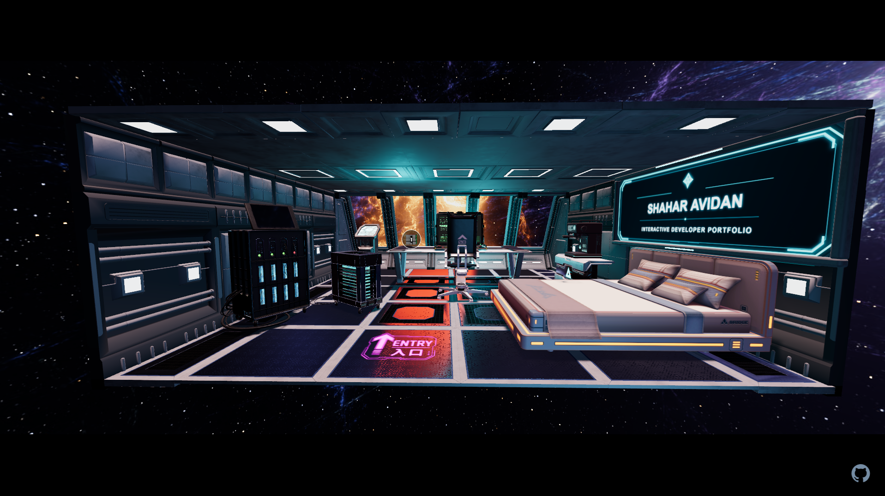
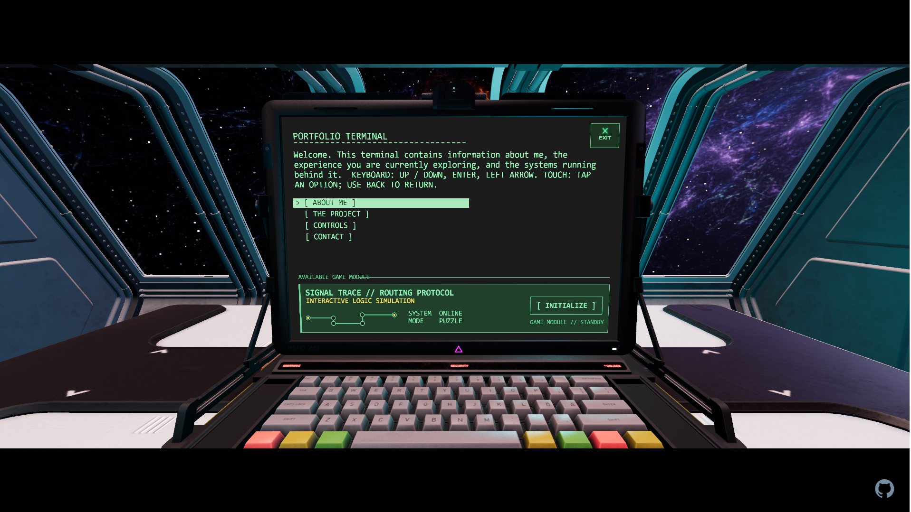

# Space Station Portfolio

An interactive 3D portfolio set inside a sci-fi space station, built with Three.js.

Instead of presenting my work through a conventional webpage, I built an explorable environment where the portfolio itself is the main project. The station combines real-time 3D rendering, interactive objects, custom shaders, canvas interfaces, and puzzle mechanics.

<!-- Replace the URL below with the deployed portfolio URL. -->
**[Launch the portfolio](YOUR_LIVE_DEMO_URL)**



<!-- Add a screenshot or short GIF once the final media is ready. -->
<!--  -->

## Highlights

- An explorable real-time 3D space station
- An interactive terminal rendered with the Canvas API and displayed inside the scene
- **Signal Trace**, a terminal-based routing puzzle with multiple handcrafted levels
- A fully interactive Rubik's Cube with layer rotations, undo support, scrambling, mouse controls, and touch support
- A custom GLSL supernova shader and a space environment visible outside the station
- A security camera that tracks the user's position within a limited rotation range
- Responsive rendering designed for desktop and mobile devices
- A cinematic loading sequence separated from asset loading to keep its animation smooth

## Technical Highlights

### Terminal system

The station terminal uses a separate 2D canvas interface mapped onto the monitor inside the 3D scene. Pointer input is translated from the browser viewport to the monitor surface using raycasting and UV coordinates.

### Signal Trace

Signal Trace is a custom puzzle game built into the terminal. Players connect signal routes using a limited inventory of pipe pieces while the game validates connections, relays, targets, and completed paths.

### Rubik's Cube

The Rubik's Cube is made from 27 independently managed cubies. Layer turns are performed by temporarily grouping the affected pieces, rotating the group, and then restoring each cubie to the cube hierarchy.

### Performance

The project was optimized to run across desktop computers, laptops, and mobile devices. The optimization work includes:

- Compressed and simplified 3D assets
- Reused geometry and instancing where appropriate
- Controlled device pixel ratio and adaptive antialiasing
- Limited shadow rendering
- Reduced unnecessary raycasting
- Fewer draw calls and duplicate resources
- Responsive canvas sizing with aspect-ratio handling
- Decoupled loading-screen animation and asset processing

## Built With

- [Three.js](https://threejs.org/) — real-time 3D rendering
- JavaScript — application logic and interaction systems
- GLSL — custom shader effects
- Canvas API — terminal interface and Signal Trace
- [GSAP](https://gsap.com/) — animation
- Blender — model editing and asset preparation

<!-- Add or remove tools to match package.json before publishing. -->

## Controls

| Input | Action |
| --- | --- |
| Mouse drag | Explore the station |
| Mouse wheel | Zoom the camera |
| Left click / tap | Interact with supported objects and interfaces |
| Right mouse drag | Rotate the Rubik's Cube while focused |

<!-- Add any final keyboard shortcuts here once they are locked in. -->

## Running Locally

```bash
git clone YOUR_REPOSITORY_URL
cd YOUR_REPOSITORY_DIRECTORY
npm install
npm run dev
```

Then open the local address shown in the terminal.

### Production Build

```bash
npm run build
```

<!-- Confirm these commands against package.json before publishing. -->

## Project Status

The portfolio is under active development. Features, presentation text, interactions, and performance are still being refined.

## AI Usage

AI tools were used during development for brainstorming, debugging, and code assistance. Generated output was reviewed, adapted, tested, and integrated into the larger project rather than used as a replacement for understanding the systems involved.

The project's direction, scene design, architecture, interaction systems, optimization decisions, and final implementation choices were shaped through my own development process.

## Asset Credits

This project includes third-party models, textures, fonts, and other creative assets. Their creators, original sources, licenses, and any modifications are documented in [CREDITS.md](./CREDITS.md).

## License

<!-- Choose a license for your own source code and add a LICENSE file. Do not apply that license to third-party assets unless their original licenses allow it. -->

The source-code license for this project has not yet been specified. Third-party assets remain subject to their respective licenses as documented in [CREDITS.md](./CREDITS.md).


